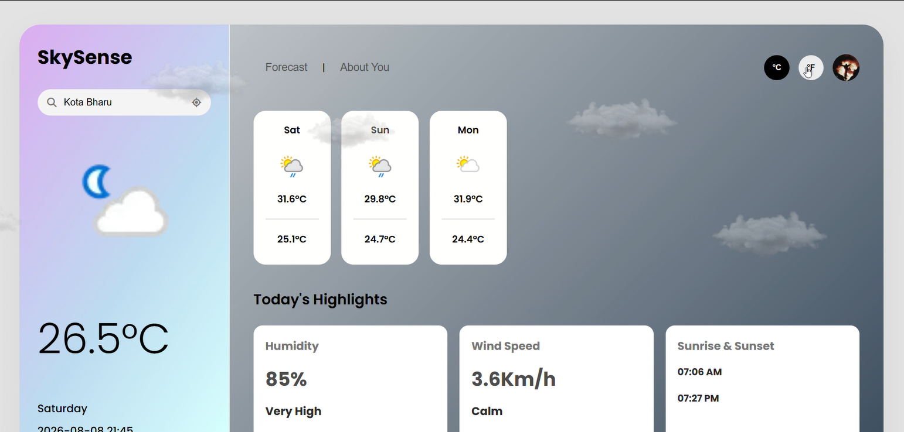

# 🌤️ SkySense

### AI-Powered Weather Intelligence Platform

SkySense is a full-stack weather application that combines real-time weather data with AI-powered recommendations, dynamic weather effects, city imagery, search history, and more engaging weather experience.

---

## 📸 Preview

<p align="center">
  
</p>

> A modern weather dashboard providing real-time weather information, forecasts, weather highlights, and dynamic visual effects.

---

## ✨ Features

- 🌦️ Real-time weather information
- 📅 Multi-day weather forecast
- 🌡️ Celsius / Fahrenheit conversion
- 🤖 AI-powered weather recommendations
- ⭐ AI-generated weather score
- ❤️ Health recommendations
- ✈️ Travel recommendations
- 🍴 Food suggestions based on weather
- 🖼️ Dynamic city images using Unsplash
- 🔍 Recent search history
- 📍 Current-location weather using browser geolocation
- 📊 UV index visualization
- 🌧️ Animated rain
- ☁️ Floating cloud animation
- ⚡ Lightning effects for thunderstorms
- ☀️ Animated sun glow
- 🎨 Dynamic weather-based backgrounds
- 📱 Responsive user interface
- 🔐 Secure API key management using environment variables

---

## 🤖 AI Intelligence

SkySense integrates **Google Gemini** to transform raw weather data into useful, personalized insights.

The application sends the current weather information to the backend, where Gemini analyzes the conditions and generates structured recommendations.

### AI provides:

- 📝 Daily weather brief
- ⭐ Weather score
- ❤️ Health advice
- ✈️ Travel advice
- 🍴 Food suggestions

### Weather data provided to the AI

```text
Temperature
Humidity
Weather Condition
Wind Speed
UV Index
Visibility